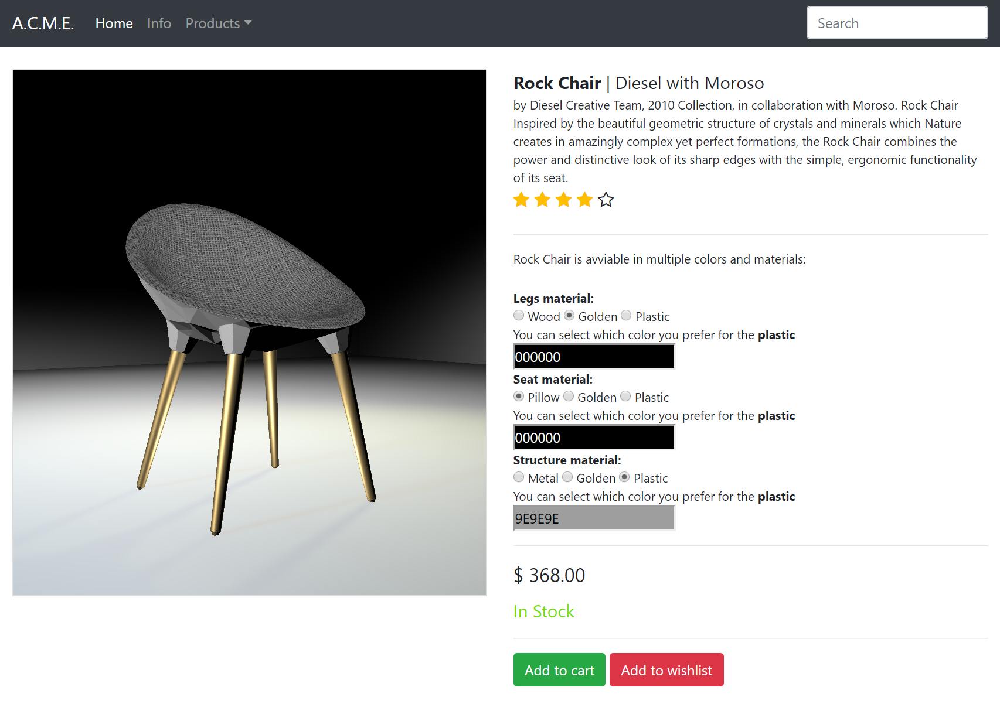

# Progetto ProductVisualization

## Goals

The well-known ACME company has asked you to build a product **Web visualizer / configurator** for its new e-commerce site. Before giving you the job, ACME wants to evaluate how faithfully you can visualize and configure products.  ACME sells everything, so you can choose whatever kind of product you want for the demonstration.

Your goal is to build a Web application (a HTML page) that:

- visualizes a product in 3D using three.js, using PBR equations and materials;
- allows the user to inspect the product (e.g. by orbiting the camera around it), and change some material on it by choosing from a few alternatives.

Try to make it look like a simple, but real portion of an e-commerce site, not a three.js example: choose carefully colors, fonts, images, and icons, also taking inspiration from real web sites. Before starting, search the web for existing 3D configurators. Note down what you like and don't like, and try to produce a result as professional as possible.

## Documenting and report

Il progetto finale consiste in una pagina HTML costruita similarmente ad una convenzionale pagina di un e-commerce che mette a disposizione dell'utente un visualizzatore 3D dell'oggetto con alcune possibilità di customizzazione oltre ad una breve descrizione dell'oggetto stesso e dei materiali.

### Contenuto della scena
Il visualizzatore è composto da una Canvas che ospita la scena 3D, la scena è composta da:
- OBJ il modello di una sedia ispirato all'iconico design realizzato da Moroso per il marchio Diesel nel 2010 (credit per il modello ad Aplusstudio https://www.cgtrader.com/free-3d-models/furniture/chair/diesel-rock-chair-by-moroso).
- Alla scena sono stati aggiunti un Piano ed un Cubo per simularne pavimento e pareti (dopo alcuni tentativi con envMap e cubeMap con risultati non soddifascenti) ai quali sono stati passati dei materiali MeshPhongMaterial di THREE.js 
- Sono stati implementati 3 punti luce di tipo SpotLight ma per esigenze implementative in alcuni materiali (Golden e Plastic) vengono calcolate come PointLight.
- Al modello sono state applicati diversi materiali per i quali sono stati realizzati diversi shader:
        1. materiale Metal Painted: texture based material che comprende le mappe per colore (diffuse), normale (o bump), roughness, ambientOcclusion, envMap (per i riflessi).
        2. materiale dorato: SpecularBRDF
        3. materiale plastico: BRDF con microfacing

### Strumenti messi a disposizione
L'utente si troverà i seguenti strumenti per interagire con il modello:
- Camera mobile attraverso orbitControl con l'accortezza di limitare i muovimenti per evitare artefatti o compenetrazione tra camera ed oggetti
- Radiobutton integrati nell'HTML per permettere il passaggio tra i diversi materiali per ognuna delle 3 parti che compongono il modello (Seduta, Struttura e Gambe).
- ColorPicker per permettere all'utente di cambiare il colore del materiale Plastico (non sono state date altre possibilità di customizzazione per matenere un senso di realisticità).
